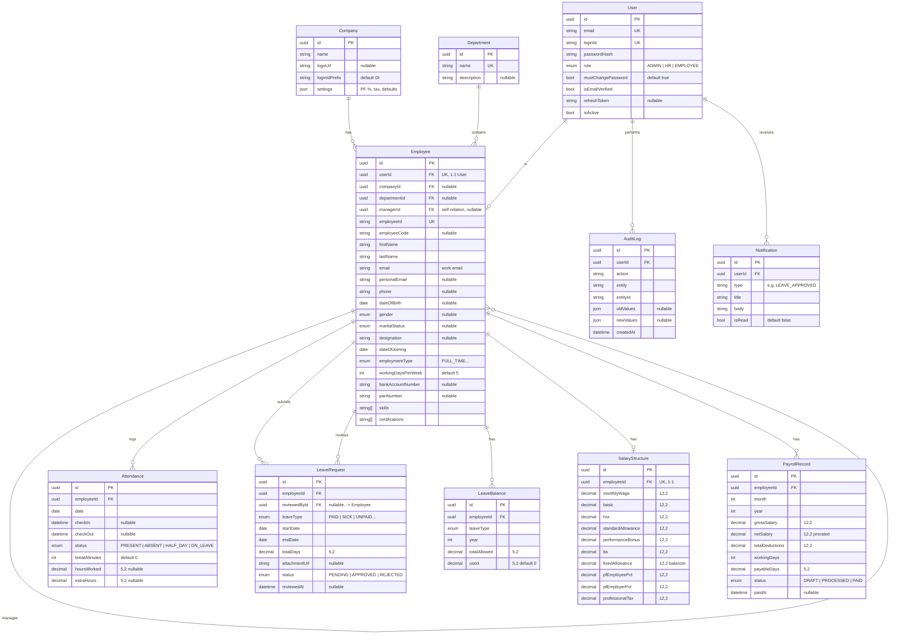

<div align="center">

# Dayflow

**Every workday, perfectly aligned.**

A production-grade Human Resource Management System — auth, employee profiles,
attendance, leave & time-off, payroll, approvals, and live analytics.

Next.js 14 · Express · PostgreSQL · Prisma · Redis · Zod · JWT · Docker · TypeScript

</div>

---

> **Built by AI agents across many sessions.** This repo is developed by AI coding
> agents (Claude Code, Google Antigravity, and others) working one *session* at a
> time in separate chats. If you are an agent, start at **[`AGENTS.md`](./AGENTS.md)**.
> If you are a human, read on.

## What it does

Dayflow digitizes the employee lifecycle for two roles — **Admin/HR** and
**Employee** — per the Odoo hackathon brief (`docs/Dayflow.pdf`):

- 🔐 Secure JWT auth (signup/signin/refresh/logout), role-based access
- 👤 Employee profiles (personal, job, salary, documents)
- 🗓️ Attendance (check-in/out, daily/weekly/monthly, admin overview)
- 🏖️ Leave & time-off (apply, balances, HR approve/reject) — **updates in real time**
- 💰 Payroll (read-only for employees, admin control) + **payslip PDF / CSV export**
- 📊 Admin analytics dashboard, 🔔 notifications, 📝 full audit trail

See **[`plan.md`](./plan.md) §2** for the differentiators that make this more than a
CRUD demo.

## Setup guide

### Prerequisites

- **Node.js** `>=18.17` — the repo pins `20` in `.nvmrc` (`nvm use`)
- **npm** `11.x` (declared `packageManager`, npm workspaces monorepo)
- **Docker** + **Docker Compose** — for local Postgres 16 and Redis 7

### 1. Install dependencies

```bash
npm install
```

Installs every workspace (`apps/*`, `packages/*`) from the single root
`package-lock.json` in one pass.

### 2. Configure environment variables

```bash
cp .env.example .env                              # reference copy (documents everything)
cp apps/api/.env.example apps/api/.env             # API reads this one
cp apps/web/.env.local.example apps/web/.env.local # Web reads this one
```

The defaults already match `docker-compose.yml`, so no edits are required for
local development. Key variables:

| Variable | Where | Purpose |
|----------|-------|---------|
| `DATABASE_URL` | `apps/api/.env` | Prisma/Postgres connection string |
| `REDIS_URL` | `apps/api/.env` | Cache, rate limiting, pub/sub |
| `JWT_ACCESS_SECRET` / `JWT_REFRESH_SECRET` | `apps/api/.env` | Sign auth tokens — change for anything non-local |
| `CORS_ORIGIN` | `apps/api/.env` | Origin allowed to call the API (the web app) |
| `NEXT_PUBLIC_API_URL` | `apps/web/.env.local` | Base API URL the web app calls (must include `/api/v1`) |

### 3. Start infrastructure (Postgres + Redis)

```bash
docker compose up -d
```

Brings up `dayflow-postgres` (`localhost:5432`, db `dayflow`) and
`dayflow-redis` (`localhost:6379`) with health checks and named volumes, so
data survives restarts. Check status with `docker compose ps`.

### 4. Set up the database

```bash
npm run db:generate   # generate the Prisma client
npm run db:migrate     # apply schema migrations (prisma migrate dev)
npm run db:seed        # load base data + rich demo dataset
```

`npm run db:studio` opens Prisma Studio (a GUI over the database) if you want
to inspect data directly.

### 5. Run the app

```bash
npm run dev
```

Runs `api` and `web` together via Turborepo. Individually:
`npm run dev --workspace @dayflow/api` or `--workspace @dayflow/web`.

- Web: http://localhost:3000 · API: http://localhost:8000/api/v1 ·
  Health: http://localhost:8000/api/v1/health

**Demo credentials (seeded):** Admin `admin@dayflow.com` / `Admin@123` ·
Employee `john@dayflow.com` / `Employee@123`

### Other useful commands

```bash
npm run build      # build all workspaces
npm run typecheck  # tsc --noEmit across workspaces
npm run lint        # eslint .
npm run format       # prettier --write .
npm run test         # vitest across workspaces
```

> Some pieces come online as the build sessions land — see current progress in
> **[`build/STATE.md`](./build/STATE.md)**.

## How this repo is built

Work is cut into **sessions** (`build/sessions/`), each a self-contained unit one
chat completes end-to-end. Context passes between chats through committed files —
never chat memory. The rules live in **[`build/SESSION_PROTOCOL.md`](./build/SESSION_PROTOCOL.md)**;
live progress in **[`build/STATE.md`](./build/STATE.md)**.

To run the next session: open `build/STATE.md`, find the next `TODO`, open its file
in `build/sessions/`, and paste its **"▶ Copy-paste prompt"** into a fresh agent chat.

## Database design

PostgreSQL, modeled with Prisma (`packages/db/prisma/schema.prisma`). Full
prose detail — salary computation, seeding strategy, ADR references — lives in
**[`docs/DATABASE.md`](./docs/DATABASE.md)**; the schematic below is generated
straight from the schema, field by field.



| Table | Purpose | Unique / composite keys |
|-------|---------|--------------------------|
| `Company` | Single-company (MVP) branding + payroll defaults | — |
| `User` | Auth identity — email/Login ID, password hash, role, refresh token | `email`, `loginId` |
| `Employee` | HR profile — personal, job, manager (self-relation), resume fields | `userId`, `employeeId` |
| `Department` | Organizational grouping for employees | `name` |
| `Attendance` | Daily check-in/out, hours worked, extra hours, breaks | `[employeeId, date]` |
| `LeaveRequest` | Leave applications — type, dates, status, reviewer | — |
| `LeaveBalance` | Yearly allowance vs. used, per employee/leave type | `[employeeId, leaveType, year]` |
| `SalaryStructure` | Active per-employee salary components, derived from wage | `employeeId` |
| `PayrollRecord` | Monthly computed payslip snapshot | `[employeeId, month, year]` |
| `AuditLog` | System action trail — who did what, to what, when | — |
| `Notification` | In-app notifications, mirrored over SSE (and optionally email) | — |

**Enums:** `Role` (`ADMIN`, `HR`, `EMPLOYEE`) · `Gender` · `MaritalStatus` ·
`EmploymentType` (`FULL_TIME`, `PART_TIME`, `CONTRACT`, `INTERN`) ·
`AttendanceStatus` · `LeaveType` (`PAID`, `SICK`, `UNPAID`, `CASUAL`,
`MATERNITY`, `PATERNITY`) · `LeaveStatus` · `PayrollStatus`.

Migrations live in `packages/db/prisma/migrations/`; apply with
`npm run db:migrate` (dev) or `prisma migrate deploy` (CI/production).

## Repository layout

```text
dayflow/
├── apps/
│   ├── api/                     # Express + TypeScript backend
│   │   └── src/
│   │       ├── config/          # env parsing/validation
│   │       ├── lib/             # jwt, password, prisma client, redis, logger, upload...
│   │       ├── middleware/      # auth, error handling, rate limiting, request-id, validate
│   │       ├── modules/         # one folder per domain: auth, employee, attendance,
│   │       │                    #   leave, payroll, department, company, notification,
│   │       │                    #   realtime (SSE), audit
│   │       ├── routes/          # route aggregation (index.ts)
│   │       ├── app.ts           # Express app wiring
│   │       └── server.ts        # entrypoint
│   └── web/                     # Next.js 14 frontend
│       └── src/
│           ├── app/             # App Router — (auth) and (protected) route groups
│           ├── components/      # layout/ and ui/ (shared presentational components)
│           ├── features/        # feature modules, e.g. auth/, dashboard/
│           ├── lib/             # api client, auth helpers, csv/format/payroll utils
│           └── test/            # vitest setup
├── packages/
│   ├── db/                      # Prisma schema, migrations, seed script
│   │   ├── prisma/
│   │   │   ├── schema.prisma
│   │   │   ├── migrations/
│   │   │   └── seed.ts
│   │   └── src/index.ts         # exports the Prisma client
│   ├── shared/                  # Zod schemas + types shared by api and web
│   │   └── src/                 # *.schema.ts per domain, constants, envelope
│   └── config/                  # shared tsconfig / eslint / prettier base configs
├── docs/                        # architecture, API contract, database, decisions, UI spec
├── UI/                          # hi-fi screen prototypes (.dc.html) + design handoff README
├── build/                       # session protocol, state ledger, session specs, logs
├── docker-compose.yml           # local Postgres 16 + Redis 7
├── .env.example                 # root reference env (documents the full variable set)
├── turbo.json                   # Turborepo task graph
└── package.json                 # npm workspaces root
```

## Documentation

| Doc | Contents |
|-----|----------|
| [`plan.md`](./plan.md) | Master plan: vision, stack, differentiators, roadmap |
| [`AGENTS.md`](./AGENTS.md) | Entry point for any AI agent |
| [`docs/ARCHITECTURE.md`](./docs/ARCHITECTURE.md) | System design, RBAC, scalability, security |
| [`docs/API.md`](./docs/API.md) | REST API contract |
| [`docs/DATABASE.md`](./docs/DATABASE.md) | Data model + ER diagram |
| [`docs/DECISIONS.md`](./docs/DECISIONS.md) | Design decisions (authoritative tie-breaker) |
| [`docs/UI_DESIGN_PROMPT.md`](./docs/UI_DESIGN_PROMPT.md) | Design system of record (tokens) + page specs |
| [`UI/README.md`](./UI/README.md) | Built design handoff — per-screen anatomy, state model, open gaps |
| [`docs/design-board.svg`](./docs/design-board.svg) | The team's detailed design board (source for ADR-012…019) |

## License

Hackathon project. All rights reserved by the Dayflow team.
