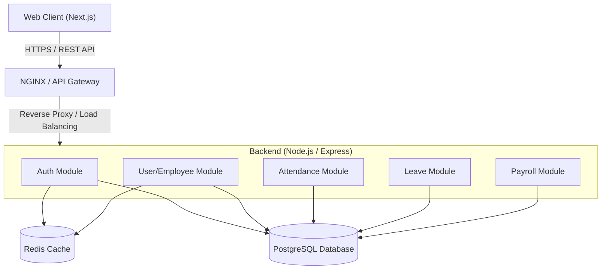
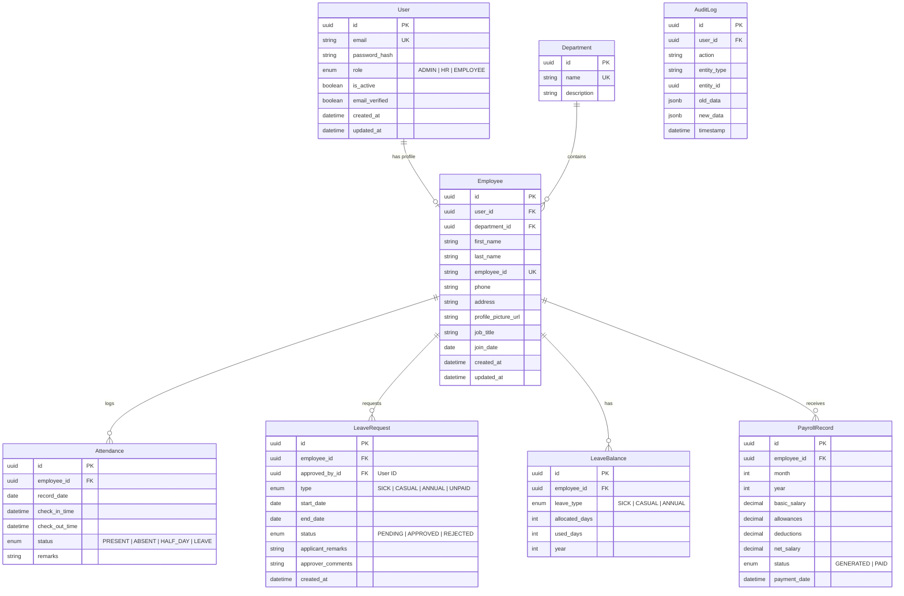

# Dayflow Architecture Document

## 1. System Overview
Dayflow is a modern, scalable Human Resource Management System (HRMS) designed to digitize and streamline core HR operations, including employee onboarding, attendance tracking, leave management, and payroll visibility. The system follows a client-server architecture, providing a responsive web interface for both Employees and Admins/HR Officers, communicating with a robust backend API.

## 2. Tech Stack
To ensure scalability, maintainability, and production-level code quality, Dayflow utilizes the following modern technology stack:

*   **Frontend:** [Next.js 14](https://nextjs.org/) (App Router) - React framework for server-side rendering, static site generation, and optimized client-side interactions.
*   **Backend:** [Node.js](https://nodejs.org/) with [Express](https://expressjs.com/) - Lightweight, unopinionated web framework for building the RESTful API.
*   **Database:** [PostgreSQL](https://www.postgresql.org/) - Powerful, open-source relational database system.
*   **ORM:** [Prisma](https://www.prisma.io/) - Next-generation ORM for Node.js and TypeScript, ensuring type safety and preventing SQL injection.
*   **Caching & Sessions:** [Redis](https://redis.io/) - In-memory data structure store used for caching API responses, rate limiting, and managing refresh token blacklists.
*   **Authentication:** JWT (JSON Web Tokens) with short-lived access tokens and http-only secure refresh tokens. bcrypt for password hashing.
*   **Validation:** [Zod](https://zod.dev/) - TypeScript-first schema declaration and validation library.
*   **Containerization:** [Docker](https://www.docker.com/) & Docker Compose - For consistent development environments and scalable production deployments.

## 3. System Architecture

The architecture employs a layered approach, separating presentation, application logic, and data management.



## 4. Project Structure
The project is organized as a monorepo using tools like Turborepo or npm workspaces to manage dependencies and share code effectively across the stack.

```
dayflow/
├── apps/
│   ├── web/                # Next.js frontend application
│   └── api/                # Node.js/Express backend API
├── packages/
│   ├── shared/             # Shared TypeScript types, Zod validators, enums
│   ├── db/                 # Prisma schema, migrations, and generated client
│   └── ui/                 # (Optional) Shared UI components
├── docker-compose.yml      # Local development setup (PostgreSQL, Redis, etc.)
└── package.json            # Root workspace configuration
```

## 5. Database Schema
The relational database model ensures data integrity and supports complex queries required for HR reporting and analytics.



## 6. API Design
The API follows RESTful principles with standard HTTP verbs and status codes, versioned under `/api/v1`.

*   **Auth Module**
    *   `POST /api/v1/auth/signup` - Register a new user
    *   `POST /api/v1/auth/signin` - Authenticate and receive tokens
    *   `POST /api/v1/auth/refresh` - Obtain a new access token using a refresh token
    *   `POST /api/v1/auth/logout` - Invalidate tokens
*   **Users & Employees Module**
    *   `GET /api/v1/employees/me` - Get current user's profile
    *   `PUT /api/v1/employees/me` - Update current user's limited profile details
    *   `GET /api/v1/employees` - List all employees (Admin/HR only)
    *   `GET /api/v1/employees/:id` - Get specific employee details (Admin/HR only)
    *   `PUT /api/v1/employees/:id` - Update any employee details (Admin/HR only)
*   **Attendance Module**
    *   `POST /api/v1/attendance/check-in` - Log check-in time
    *   `POST /api/v1/attendance/check-out` - Log check-out time
    *   `GET /api/v1/attendance/me` - Get current user's attendance records
    *   `GET /api/v1/attendance` - Get all attendance records (Admin/HR only)
*   **Leave Module**
    *   `POST /api/v1/leaves` - Apply for leave
    *   `GET /api/v1/leaves/me` - List user's leave requests
    *   `GET /api/v1/leaves` - List all leave requests (Admin/HR only)
    *   `PUT /api/v1/leaves/:id/status` - Approve/Reject leave (Admin/HR only)
    *   `GET /api/v1/leaves/balances/me` - Get user's leave balance
*   **Payroll Module**
    *   `GET /api/v1/payroll/me` - View own salary/payroll records
    *   `GET /api/v1/payroll` - View all payroll records (Admin/HR only)

## 7. Authentication Flow
Dayflow utilizes a secure JWT-based stateless authentication mechanism combined with HttpOnly cookies for enhanced security against XSS attacks.

1.  **Login**: User authenticates with credentials.
2.  **Token Issuance**: Backend validates and issues:
    *   `access_token` (JWT, short lifespan e.g., 15 mins) returned in JSON payload for client memory.
    *   `refresh_token` (JWT/Opaque, long lifespan e.g., 7 days) set as a secure, `HttpOnly`, `SameSite=Strict` cookie.
3.  **API Requests**: Client attaches the `access_token` in the `Authorization: Bearer <token>` header.
4.  **Token Refresh**: When the `access_token` expires, the client makes a request to `/api/v1/auth/refresh`. The browser automatically sends the `refresh_token` cookie. If valid, a new `access_token` is issued.
5.  **Logout**: The `refresh_token` cookie is cleared, and the token is optionally blacklisted in Redis.

## 8. Role-Based Access Control (RBAC)
Authorization is enforced at both the UI and API layers.

*   **API Level (Middleware)**: Custom Express middlewares (`requireAuth`, `requireRole(['ADMIN', 'HR'])`) decode the JWT, extract the user's role, and verify permissions before allowing access to route handlers.
*   **Data Level (Row-Level Security)**: For endpoints like `GET /api/v1/employees/:id`, the service layer checks if the requesting user ID matches the target ID (if the user is an EMPLOYEE) or allows the request if the user is an ADMIN.
*   **UI Level (Next.js)**: Component rendering is conditional based on the decoded JWT payload stored in the application state. Protected routes redirect unauthorized users to the login page or a '403 Forbidden' page.

## 9. Scalability Considerations
The architecture is designed to handle a growing number of users and data volume:

*   **Database Indexing**: Critical columns like `user_id`, `email`, `employee_id`, `status`, and date fields (e.g., `record_date` in Attendance) are indexed to speed up read queries.
*   **Connection Pooling**: Prisma integrates with PgBouncer or uses its built-in connection pool to manage database connections efficiently, preventing connection exhaustion under load.
*   **Caching Layer (Redis)**:
    *   Frequently accessed, rarely changing data (e.g., department lists, holiday calendars) are cached.
    *   Session management (refresh token blacklisting/whitelisting) utilizes Redis for high performance.
*   **Horizontal Scaling**: The Node.js backend is stateless (session state is in Redis/JWTs), allowing multiple instances to be spun up behind a load balancer to handle increased API traffic.
*   **Rate Limiting**: Implemented via Redis to prevent brute-force attacks on auth endpoints and to ensure fair usage of the API.

## 10. Security
Security is baked into the development lifecycle adhering to OWASP guidelines:

*   **Input Validation**: `Zod` is used at the API boundary to strictly validate all incoming request bodies, queries, and parameters against predefined schemas before they hit the controller logic.
*   **SQL Injection Prevention**: Using `Prisma` ORM inherently mitigates SQL injection by using parameterized queries.
*   **XSS Prevention**: Next.js automatically escapes data in the frontend. `HttpOnly` cookies are used for refresh tokens to prevent access via malicious scripts.
*   **CORS**: Configured strictly to allow requests only from the authorized frontend domains.
*   **Helmet**: Express `helmet` middleware is used to set secure HTTP headers (e.g., HSTS, X-Content-Type-Options, Content-Security-Policy).
*   **Password Security**: `bcrypt` with an appropriate work factor (salt rounds) is used to hash passwords securely.

## 11. Error Handling
A centralized error handling mechanism ensures consistent JSON responses. Custom error classes (e.g., `NotFoundError`, `ValidationError`, `UnauthorizedError`) extend standard Error.

**Standard Error Response Format:**
```json
{
  "success": false,
  "error": {
    "code": "VALIDATION_FAILED",
    "message": "Invalid input provided.",
    "details": [
      {
        "field": "email",
        "message": "Must be a valid email address."
      }
    ]
  }
}
```
An Express error-handling middleware catches all unhandled exceptions, logs them appropriately (sanitizing sensitive data), and formats the response according to the standard.

## 12. Deployment Architecture
The application is containerized using Docker, ensuring parity between environments.

*   **Local Development**: `docker-compose.yml` defines the entire stack (App, API, Postgres, Redis) for a single-command setup (`docker-compose up`).
*   **Production Deployment**:
    *   The frontend (Next.js) can be deployed to edge networks like Vercel or AWS Amplify for optimal global delivery.
    *   The backend (Node.js API) is deployed as Docker containers orchestrated by ECS, EKS, or a managed service like AWS App Runner or Google Cloud Run.
    *   Managed databases (e.g., AWS RDS for PostgreSQL, AWS ElastiCache for Redis) are recommended for production for automated backups, high availability, and scaling.
    *   A CI/CD pipeline (e.g., GitHub Actions) automates linting, testing, Docker image building, and deployment upon pushing to the main branch.
