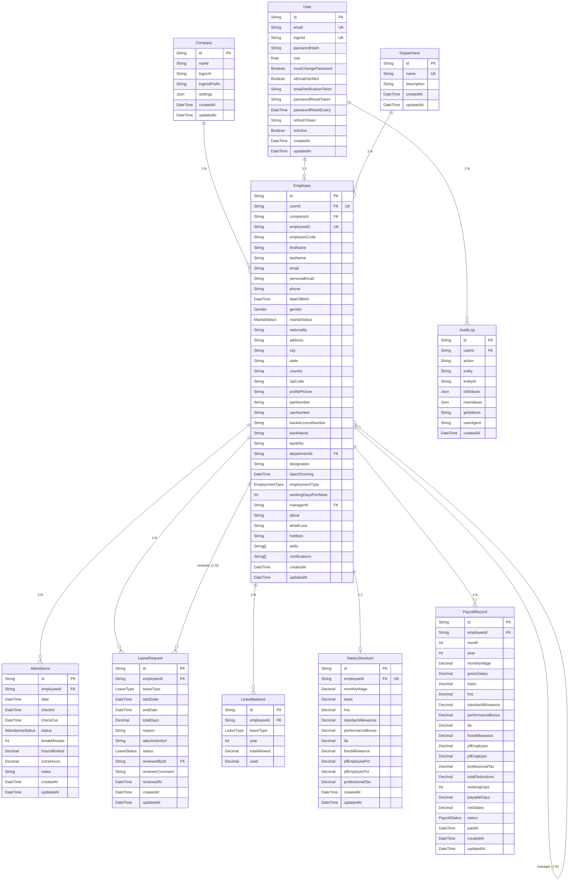

# Dayflow Database Architecture

This document provides a comprehensive overview of the Dayflow Human Resource Management System (HRMS) database schema. The database is modeled in PostgreSQL and managed using Prisma.

## Entity Relationship Diagram

## Enums

- **`Role`**: `ADMIN`, `EMPLOYEE` (see ADR-001; `HR` is added by S01 per that ADR).
- **`Gender`**: `MALE`, `FEMALE`, `OTHER`.
- **`MaritalStatus`**: `SINGLE`, `MARRIED`, `OTHER` (ADR-015). Nullable on `Employee`.
- **`EmploymentType`**: `FULL_TIME`, `PART_TIME`, `CONTRACT`, `INTERN`.
- **`AttendanceStatus`**: `PRESENT`, `ABSENT`, `HALF_DAY`, `ON_LEAVE` (ADR-005).
- **`LeaveType`**: `PAID`, `SICK`, `UNPAID`, `CASUAL`, `MATERNITY`, `PATERNITY` (ADR-004).
- **`LeaveStatus`**: `PENDING`, `APPROVED`, `REJECTED`.
- **`PayrollStatus`**: `DRAFT`, `PROCESSED`, `PAID`.

## Schema Details

### `Company` (ADR-016)
Single-company (MVP) branding and payroll-settings entity. One row is seeded (e.g. "Odoo India", prefix `OI`).
- **Fields**: `name`, `logoUrl?`, `loginIdPrefix` (default `"OI"`, feeds the auto-generated Login ID — ADR-012), and a `settings` JSON blob.
- **`settings` JSON** holds configurable rates/defaults: PF employee %, PF employer %, professional tax, salary-component default %s, and default working-days-per-week.
- **Relationships**: 1:N with `Employee` (`Employee.companyId`, `SetNull` on delete).

### `User`
Manages system authentication and authorization.
- **Constraints**: `id` (PK), `email` (Unique), `loginId` (Unique).
- **New fields (ADR-012)**: `loginId` — the auto-generated Login ID (format `OI` + 2 letters of first name + 2 of last name + join year + 4-digit serial, e.g. `OIJODO20220001`); `mustChangePassword` (default `true`) — forces a password change after first login. Login accepts email **or** Login ID.
- **Indexes**: `email` (for fast lookups during login).
- **Relationships**: 1:1 with `Employee`, 1:N with `AuditLog`.

### `Employee`
Contains all HR profile data for a user. Expanded to cover the board's My Profile → Private Info and Resume tabs (ADR-015).
- **Constraints**: `id` (PK), `userId` (Unique), `employeeId` (Unique).
- **Private Info fields (ADR-015)**: `personalEmail?`, `maritalStatus?`, `nationality?`, `panNumber?`, `uanNumber?` (PF), `employeeCode?` (may equal `employeeId`), `workingDaysPerWeek` (Int, default 5), bank details `bankAccountNumber?`, `bankName?`, `bankIfsc?`.
- **Resume fields (ADR-015, optional)**: `about`, `whatILove`, `hobbies` (Text), `skills` (String[]), `certifications` (String[]).
- **Relationships**:
  - `User`: Deletion cascades.
  - `Company`: `companyId?`; if the company is deleted, the field is set to NULL.
  - `Department`: If a department is deleted, the field is set to NULL.
  - **Reporting manager (self-relation)**: `managerId?` → `manager` (`Employee?`) via the named relation `EmployeeManager`, with the `reports` (`Employee[]`) back-relation. `SetNull` on manager delete.
  - 1:1 with `SalaryStructure`.

### `Department`
Organizational groups for employees.
- **Constraints**: `id` (PK), `name` (Unique).

### `Attendance`
Tracks daily employee time logs.
- **Constraints**: Unique constraint on `[employeeId, date]` to prevent duplicate logs per day.
- **Indexes**: `employeeId`, `date`, `[employeeId, date]` composite index for rapid filtering and reporting.
- **New fields (ADR-019)**: `breakMinutes` (Int, default 0); `extraHours` (Decimal, nullable) — hours beyond the standard day. `hoursWorked` = worked − breaks. The board list view shows Date, Check In, Check Out, Work Hours, Extra Hours, Break.

### `LeaveRequest`
Records of leave taken by employees.
- **Indexes**: `employeeId`, `status`, `[employeeId, status]` to quickly query an employee's pending or approved leaves.
- **New field (ADR-018)**: `attachmentUrl?` — sick-leave certificate / supporting document.
- **Relationships**: Reviewer is related via `reviewedById` pointing to another `Employee`.

### `LeaveBalance`
Yearly leave balance allocations per employee. Balances are allocated by Admin/HR (ADR-018).
- **Constraints**: Unique on `[employeeId, leaveType, year]`. `remaining` balance is dynamically calculated as `totalAllowed - used`.

### `SalaryStructure` (ADR-013)
Per-employee active salary definition — **one per employee** (`employeeId` is Unique). All amounts derive from `monthlyWage` and auto-recompute when the Wage changes.
- **Earning components**: `basic`, `hra`, `standardAllowance`, `performanceBonus`, `lta`, `fixedAllowance` (the balancer). See the defaults in the Salary computation note.
- **Deduction config**: `pfEmployeePct`, `pfEmployerPct`, `professionalTax`.
- All money uses `Decimal(12,2)` in INR (ADR-008). Deletion cascades with `Employee`.

### `PayrollRecord`
Monthly **computed snapshot** of a payslip (ADR-013/014), regenerated from `Attendance` + `LeaveRequest` + `SalaryStructure`.
- **Constraints**: Unique on `[employeeId, month, year]` to ensure one payslip per month per employee.
- **Snapshot fields**: `monthlyWage`, `grossSalary`, the earning components (`basic`, `hra`, `standardAllowance`, `performanceBonus`, `lta`, `fixedAllowance`), the deductions (`pfEmployee`, `pfEmployer`, `professionalTax`, `totalDeductions`), attendance proration (`workingDays` Int, `payableDays` Decimal), and the final prorated `netSalary`. `status` (`PayrollStatus`) and `paidAt?` track payment.
- The old `conveyance/medical/special/incomeTax` columns are removed in favour of this component model.

### `AuditLog`
Security and auditing entity for tracking major system actions.
- **Indexes**: `userId`, `entity`, `createdAt` to allow querying activity by user, resource, or date.

## Salary computation (ADR-013/014)

Salary is component-based, derived from a monthly **Wage**, and stored as `Decimal`. Defaults (all configurable via `Company.settings`, ADR-016):

| Component | Rule (default) |
|-----------|----------------|
| Basic Salary | 50% of Wage |
| HRA | 50% of Basic |
| Standard Allowance | fixed / configured |
| Performance Bonus | 8.33% of Basic |
| LTA | 8.33% of Basic |
| Fixed Allowance | **Wage − sum(all above)** (balancer) |

- **Deductions**: PF = employee 12% of Basic (deducted from take-home) + employer 12% of Basic (CTC only, not deducted); Professional Tax = fixed ₹200/month.
- **Gross** = sum(earning components) = Wage. **Monthly net** = Gross − employeePF − professionalTax.
- **Attendance proration (ADR-014)**: `payableDays = workingDaysInMonth − unpaidLeaveDays − missingAttendanceDays` (approved PAID/SICK leave still counts as payable; only `UNPAID` leave and unexcused absences reduce it). `netSalary = round(monthlyNet × payableDays / workingDaysInMonth)`. `workingDaysInMonth` derives from `Employee.workingDaysPerWeek` (default 5, Mon–Fri) minus company holidays (optional in MVP).
- Salary math lives in a pure, unit-tested `computeSalary(wage, cfg)`; the Salary Info tab is Admin-only.

## Seeding Strategy
- **Company**: Seed one `Company` row (single-company MVP, e.g. "Odoo India", `loginIdPrefix = "OI"`) with default PF/tax/component rates in `settings` (ADR-016). Employees link to it via `companyId`.
- **Base Data**: Seed static enums or standard departments (e.g., HR, Engineering, Sales) on initialization.
- **Admin Setup**: Seed the first admin `User` (with a generated `loginId`) and its `Employee` record if the database is empty in non-production environments to allow initial login (ADR-012). The public signup endpoint is bootstrap/admin-onboarding only.

## Migration Strategy
- Use Prisma `migrate dev` during development.
- For production, build migrations using `prisma migrate deploy` to safely apply structured SQL changes in CI/CD.
- Take particular care when adding enums or renaming columns; favor additive changes where possible.
