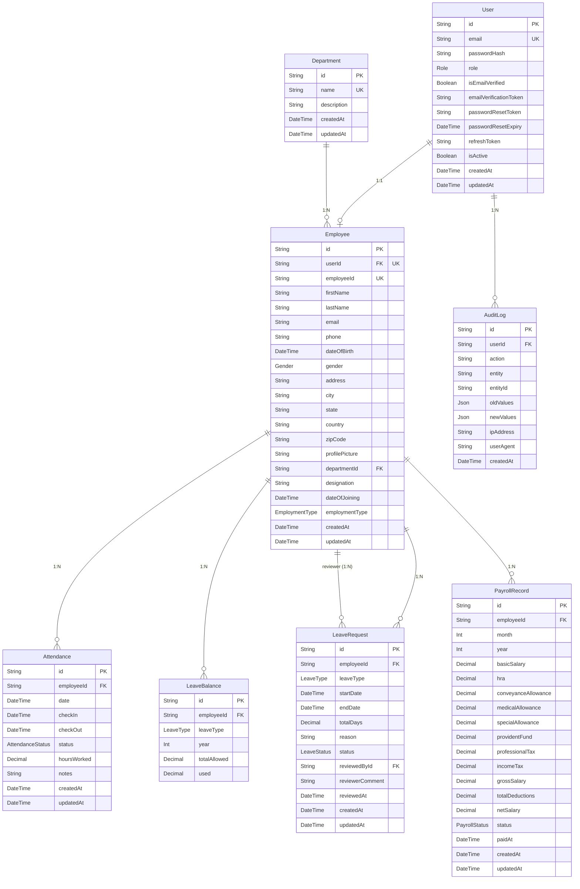

# Dayflow Database Architecture

This document provides a comprehensive overview of the Dayflow Human Resource Management System (HRMS) database schema. The database is modeled in PostgreSQL and managed using Prisma.

## Entity Relationship Diagram

## Schema Details

### `User`
Manages system authentication and authorization.
- **Constraints**: `id` (PK), `email` (Unique).
- **Indexes**: `email` (For fast lookups during login).
- **Relationships**: 1:1 with `Employee`, 1:N with `AuditLog`.

### `Employee`
Contains all HR profile data for a user.
- **Constraints**: `id` (PK), `userId` (Unique), `employeeId` (Unique).
- **Relationships**:
  - `User`: Deletion cascades.
  - `Department`: If a department is deleted, the field is set to NULL.

### `Department`
Organizational groups for employees.
- **Constraints**: `id` (PK), `name` (Unique).

### `Attendance`
Tracks daily employee time logs.
- **Constraints**: Unique constraint on `[employeeId, date]` to prevent duplicate logs per day.
- **Indexes**: `employeeId`, `date`, `[employeeId, date]` composite index for rapid filtering and reporting.

### `LeaveRequest`
Records of leave taken by employees.
- **Indexes**: `employeeId`, `status`, `[employeeId, status]` to quickly query an employee's pending or approved leaves.
- **Relationships**: Reviewer is related via `reviewedById` pointing to another `Employee`.

### `LeaveBalance`
Yearly leave balance allocations per employee.
- **Constraints**: Unique on `[employeeId, leaveType, year]`. `remaining` balance is dynamically calculated as `totalAllowed - used`.

### `PayrollRecord`
Monthly generated payrolls for employees.
- **Constraints**: Unique on `[employeeId, month, year]` to ensure one payslip per month per employee.

### `AuditLog`
Security and auditing entity for tracking major system actions.
- **Indexes**: `userId`, `entity`, `createdAt` to allow querying activity by user, resource, or date.

## Seeding Strategy
- **Base Data**: Seed static enums or standard departments (e.g., HR, Engineering, Sales) on initialization.
- **Admin Setup**: Seed a default admin `User` and `Employee` record if the database is empty in non-production environments to allow initial login.

## Migration Strategy
- Use Prisma `migrate dev` during development.
- For production, build migrations using `prisma migrate deploy` to safely apply structured SQL changes in CI/CD.
- Take particular care when adding enums or renaming columns; favor additive changes where possible.
